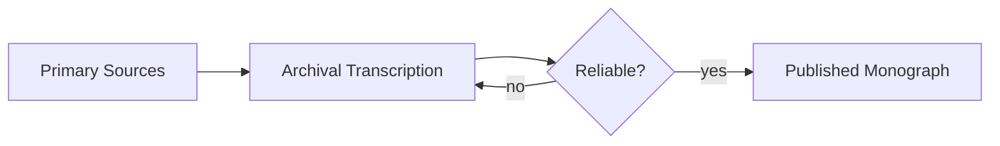
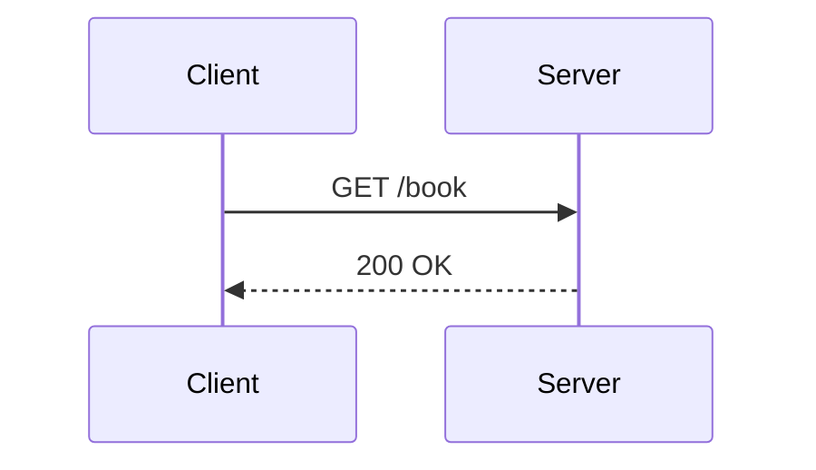

# Diagrams


```mermaid
flowchart LR
  A[Primary Sources] --> B[Archival Transcription]
  B --> C{Reliable?}
  C -->|yes| D[Published Monograph]
  C -->|no| B
```


```mermaid
sequenceDiagram
  participant Client
  participant Server
  Client->>Server: GET /book
  Server-->>Client: 200 OK
```

```
+----------+      +----------+
|  Parser  | ---> |  Builder |
+----------+      +----------+
```
